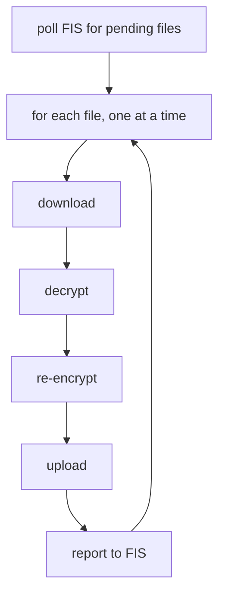
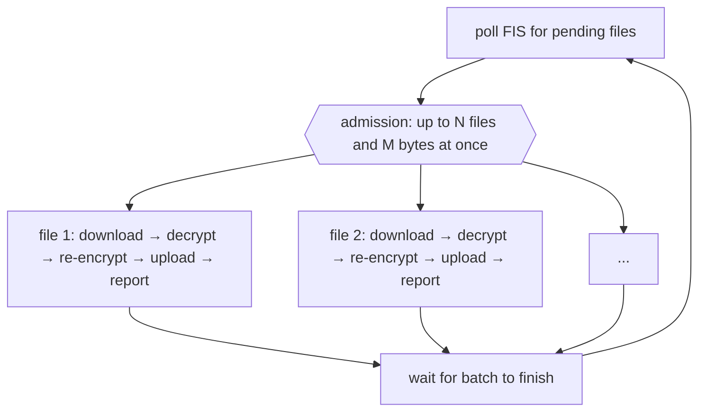

# Parallelize DHFS File Interrogation (Army Ant)
**Epic Type:** Implementation Epic

Epic planning and implementation follow the
[Epic Planning and Marathon SOP](https://ghga.pages.hzdr.de/internal.ghga.de/main/sops/development/epic_planning/).

## Scope

### Outline:

DHFS (Data Hub File Service) polls FIS for files that need interrogation and re-encryption, then works through them one file at a time. It downloads a file, decrypts it, re-encrypts it with a new secret, uploads it, and reports back to FIS before moving on to the next file. When there's a large backlog for a given Data Hub, or a batch of big files, this adds up. Files sit around waiting their turn even though nothing requires them to be processed in order.

This epic changes the interrogation loop so DHFS works on several files at once, up to a configurable limit, instead of sequentially. Before we can do that safely, a few pieces of shared client code need small fixes, because they were written assuming only one request is ever in flight at a time.

### Included/Required:

- Add bounded concurrency to the file loop in `Interrogator.interrogate_new_files()` so multiple `interrogate_file()` calls run simultaneously.
- Add a new config setting for how many files DHFS is allowed to work on at once (e.g. `max_concurrent_files`), alongside the existing `min_run_interval_seconds` poll setting.
- Add a second config setting bounding how much part data DHFS may hold in memory across all files at once (e.g. `max_interrogation_memory_mib`). The file count on its own does not limit memory use, for the reasons described under "Memory use and admission control" below.
- Add a check to the start of `interrogate_file()` that consults both `max_concurrent_files` and `max_interrogation_memory_mib`, so a file only begins when allowed. `asyncio.Semaphore` alone can gate based on `max_concurrent_files`, but it can't handle the memory limitation side of things. That check should be based on part size.
- Update `AsyncRateLimitingTransport` (from `ghga-service-commons`) so its internal 429/backoff handling (`_num_requests`, `_last_retry_after_received`, `_wait_time`) stays correct when several requests go through it at once. Right now these are used without any coordination, so retry handling will be tangled with concurrent requests. Alternatively, handle all retry logic in DHFS itself and/or implement a custom transport.
- Set explicit connection pool limits (`httpx2.Limits`) on the shared client DHFS builds in `get_configured_httpx_client()` (`services/datahub-file-service/src/dhfs/adapters/outbound/http.py`). The plumbing for this already exists in `CompositeTransportFactory.create_ratelimiting_retry_transport()`, it just isn't being used yet. Without it, the default pool size becomes a hidden cap on how much concurrency we actually get. 
- Widen the gap between `DOWNLOAD_URL_LIFESPAN` and `DOWNLOAD_URL_CACHE_TIME` (`services/datahub-file-service/src/dhfs/constants.py`) from 5 seconds to 15, so a cached presigned URL is less likely to expire while the request waits its turn.
- Rework the per-file timing log at the end of `_process_file_parts()`. The `*_s` and `*_mib_per_s` fields are measured as wall clock time around each phase, so once files overlap they also count time the file spent waiting behind other files, and the throughput figures stop describing the phase they are named after. Either report the elapsed times without the derived MiB/s fields, or move throughput reporting up to the batch level.
- Update the DHFS README's configuration section to document the new settings. The README section is generated from `config_schema.json`, so `config_schema.json` and `example_config.yaml` need regenerating too.

### Optional:

- Apply the same bounded-concurrency treatment to the part-level loop inside a single file (`_process_file_parts()`), so very large files also see a speedup. This is more involved because parts have to be assembled into the multipart upload buffer in order, so it needs either an ordered queue or a way to reassemble out-of-order results before uploading.

### Not included:

- Running multiple DHFS replicas per hub as a way to add throughput. There is currently no claim or lease mechanism between DHFS and FIS, so two replicas would both pick up and redundantly process the same file. Making that safe is a separate design challenge involving FIS.
- Any change to what FIS returns from `GET /storages/{alias}/uploads`. FIS still hands back the whole batch of pending files in one call, with no pagination or per-file claiming.

## Additional Implementation Details:

### Current behavior


`interrogate_new_files()` fetches a full batch of pending files from FIS and then loops over them with a plain `for` loop, calling `await self.interrogate_file(file)` on each one. The next file won't start until the current one is fully processed.



### Target behavior


Wrap the same loop so that each file passes through an admission step before its task is created, then run the calls in an `asyncio.TaskGroup`. Admission holds an `asyncio.Semaphore(config.max_concurrent_files)` for the file count and a memory budget for the part data. Each `interrogate_file()` call still does its own download/decrypt/re-encrypt/upload/report sequence, but several of them run concurrently. Everything for a given file (secrets, checksums, upload buffer) lives on the call stack of the `interrogate_file()` call.

`TaskGroup` is the right choice over `asyncio.gather` here because a `CriticalError` is supposed to stop DHFS, and the TaskGroup cancels the sibling files instead of leaving them running unattended while the service shuts down. Those files are simply picked up again on the next poll.

Two consequences of using a TaskGroup need handling. The first is that it wraps whatever the child tasks raise in an `ExceptionGroup`, and `ExceptionGroup` is itself a subclass of `Exception`. The `except InterrogatorPort.CriticalError` branch in `run_interrogator()` would therefore stop matching, the group would fall through to the general `except Exception` branch below it, and DHFS would log an ordinary error and go back to polling instead of shutting down. So we need to make sure either `interrogate_new_files()` unwraps the group and re-raises the `CriticalError`, or `run_interrogator()` switches to `except*`.

The second is that we need some way to clean up MPUs of other ongoing files when encountering a `CriticalError`. 



### Why the prerequisite fixes matter

- **Rate limiter state**: the transport's backoff logic assumes one request finishes before the next one starts reading the same fields. Under concurrency, two requests can both read a stale wait time, both decide it's safe to go, and both fire before the required wait time (from a 429) as elapsed. This can be fixed with a lock around the read-modify-write in `handle_async_request()`. The lock needs to cover only the state update. That method also contains the `await asyncio.sleep()` and the call that delegates to the wrapped transport, and holding the lock across either of those would put every request back into series, defeating the purpose of this epic.
- **Connection pool limits**: httpx2's default pool caps total connections at 100 and keepalive at 20. Parts within a single file are downloaded and uploaded one after another, so each `interrogate_file()` call only ever has one request in flight and the number of connections tracks `max_concurrent_files` directly. At the concurrency this epic is aiming for the defaults are not a hard cap, though going past 20 files at once means connections get closed and reopened that could have been kept alive. Setting the limits explicitly from `max_concurrent_files` keeps the pool sized on purpose, and it starts to matter a lot more if the optional part-level concurrency is added later, since that puts several requests in flight per file.

### Memory use and admission control

Every file being worked on holds several copies of the current part in memory at the same time:
- the encrypted part downloaded from the inbox
- the decrypted part
- the re-encrypted part
- the second decryption used for verification
- the upload buffer

The buffer gets copied again each time a part is sliced off and handed to S3. Measuring the loop with `tracemalloc` on 16 MiB parts puts the peak at 5 times the part size for a single file. Releasing each stage as soon as it stops being needed brings that down to about 3, but that only moves the constant. Memory still scales with the number and the size of the files in flight, so it is left out of this epic.

The part size is not a constant we control. `FileUpload.adjusted_part_size` starts from the part size the submitter used, but `core/models.py` raises it whenever a file would otherwise need more than the S3 limit of 10,000 parts. A 1 TB file ends up with parts around 100 MB, and a 5 TB file with parts around 500 MB. At 5 copies, that one 5 TB file can occupy something like 2.5 GB for as long as it is being processed.

This is what makes the file count insufficient as the only limit. Four small files and four very large files cost wildly different amounts of memory, and `max_concurrent_files` has no way to tell them apart. A batch that happens to contain a few large files can exhaust the container well before the count limit is anywhere near reached.

The useful thing here is that the cost of a file is known before we start it. `adjusted_part_size` is derived entirely from fields FIS already sends in the batch, so admission can look at a file and decide whether there is room for it:

```python
cost = PEAK_PART_COPIES * file_upload.adjusted_part_size
```

`PEAK_PART_COPIES` is 5, from the measurement above. It belongs in code rather than in config, because it describes how `_process_file_parts()` happens to be written today and changes if someone adds or removes a buffer in that loop.

A few details this needs to get right:

- **Weighted acquire**: `asyncio.Semaphore` only counts, so the memory budget needs a gate of its own. An `asyncio.Condition` guarding a running total is enough. Acquire waits until the requested number of bytes is available, and release wakes the waiters.
- **Oversized files**: a file whose cost is larger than the whole budget would sit in the queue forever and DHFS would quietly stall on it. Admission needs a rule that when nothing else is running, the next file starts regardless of what it costs.
- **Ordering**: admitting whichever waiting file happens to fit will starve the large ones behind a steady stream of small ones. Files should be admitted in the order FIS returned them.
- **Relationship to the container limit**: the budget only helps if it is set below the memory the pod actually has. `chart-values.yaml` currently sets no memory request or limit for DHFS at all, so that needs revisiting when this is rolled out.

### What was checked and ruled out

Investigated whether hexkit's `S3ObjectStorage` boto3 resource client (`self._resource`, used for bucket listing/deletion) is a thread-safety concern here. It isn't reached anywhere in the `interrogate_file()` call path, only from `S3Cleaner.scan_and_clean()` via `list_files_in_interrogation_bucket()`. Nothing to fix for the required scope of this epic.

Considered moving the crypt4gh decrypt and re-encrypt calls in `_decrypt_part()` / `_reencrypt_part()` off the event loop with `asyncio.to_thread`. PyNaCl does release the GIL inside the compiled CFFI call, but that isn't where the time goes: the surrounding per-segment Python work (64 KiB slicing, `bytearray` concatenation, cffi's per-call buffer allocation) holds the GIL and dominates. Benchmarking the actual loop shape on 6 MiB parts gave roughly 1.2-1.3x on 2 threads, ~1.0-1.2x on 4, and a slight regression on 8 - nowhere near the multi-core scaling that would justify it. Getting a real win would mean restructuring the segment loops toward fewer, larger GIL-free calls (or a process pool), which is its own piece of work. Not worth doing as part of this epic; the concurrency here comes from overlapping I/O.

Also note that hexkit already routes every boto3 call through `asyncio.to_thread`. Any future attempt to thread the crypto work needs its own executor rather than the default one, or multi-second CPU jobs will queue ahead of S3 metadata calls like presigned URL generation and multipart upload completion.

### Testing

- Unit/integration tests should cover the file count gate directly, e.g. asserting that no more than `max_concurrent_files` interrogations run at once given a mock that tracks concurrent entries.
- Add a regression test for the rate limiter fix that fires several concurrent requests through `AsyncRateLimitingTransport` against a mock 429 response and checks whether the resulting wait behavior is still reasonable.
- Existing interrogation tests should keep passing with `max_concurrent_files=1` and the memory budget set high enough to stay out of the way, processing files in the same order and with the same results as today's serial loop. Error propagation is the one thing that won't match, since failures now come out of the TaskGroup wrapped in an `ExceptionGroup`. That's a good check to run before turning concurrency up.
- Cover the `CriticalError` path end to end, asserting that one raised mid-batch actually stops `run_interrogator()` rather than being treated as a generic error and polled again.
- `test_interrogate_new_files` pairs reports with files using `zip(received_reports, file_uploads, strict=True)`, which assumes reports come back in the order the files were submitted. That assumption goes away once files overlap, so the test needs to match reports to files by `file_id` instead.
- Add a test for the memory gate covering a batch whose files have very different `adjusted_part_size` values, asserting that the combined cost of the running files never goes over the budget.
- Add a test that a file whose cost is larger than the entire budget still gets processed instead of waiting forever.
- Pin `PEAK_PART_COPIES` with a `tracemalloc` test over `_process_file_parts()`, so that the constant the budget relies on doesn't silently drift when that loop is edited later.
- Load test against a local S3-compatible backend (e.g. MinIO) with a batch of files to check that throughput actually improves and that the connection pool limit change doesn't get maxed out or exhausted unexpectedly.

## Human Resource/Time Estimation:

Number of sprints required: 1

Number of developers required: 1
