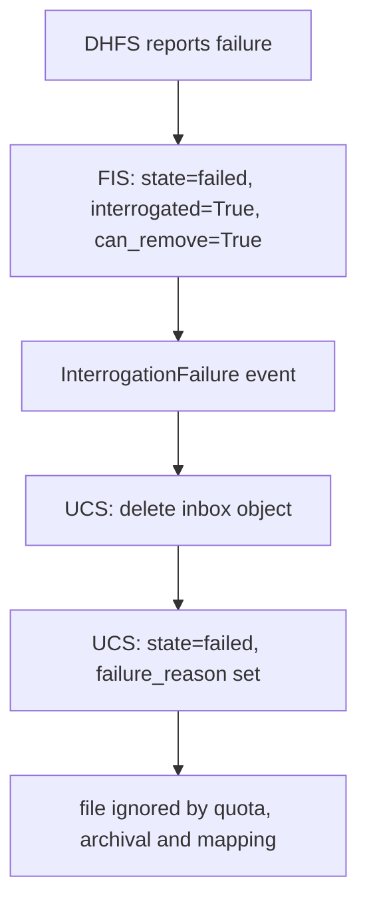
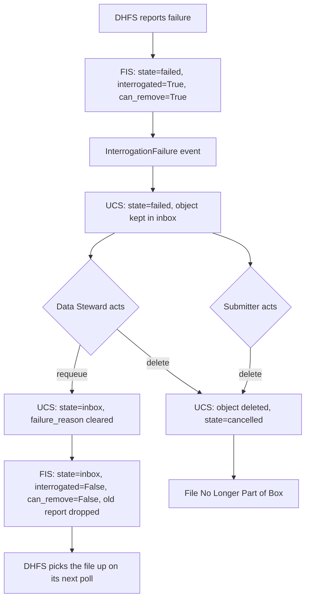

# Force Resolution of Failed Uploads (Shovelnose Guitarfish)
**Epic Type:** Implementation Epic

Epic planning and implementation follow the
[Epic Planning and Marathon SOP](https://ghga.pages.hzdr.de/internal.ghga.de/main/sops/development/epic_planning/).

## Scope
### Outline:
When files don't pass re-encryption and integrity checks ("interrogation") in DHFS, DHFS submits a report to FIS saying that the file failed. The FileUpload state is updated and propagated, and the object is deleted from the inbox bucket in S3 automatically. This is a naive approach to interrogation failures that forces the user to upload the file from scratch when it's entirely possible the fault is ours or due to some flipped bit. Moreover, "failed" files are ignored in most considerations in the file upload path, like RDUB quota calculations and archival prerequisite checks. At the macro level, this epic introduces three changes to this process:
1. Failed files are not automatically deleted from the inbox bucket.
2. Data Stewards are able to trigger a "retry" - setting the file state back to "inbox".
3. Failed files are no longer ignored. For example, they count toward box quotas and block box archival.

### Included/Required:
- Add endpoints to RS and UCS to enable Data Stewards to requeue files that fail interrogation.
- Update UCS so failed files:
  - Count toward box quotas
  - Are returned in FileUpload lists by default
  - Block box archival

### Optional:
- Update Data Portal to expose new file "requeue" feature to Data Stewards. This can also be done as a separate epic or ticket.

## API Definitions:

### RESTful/Synchronous:

New endpoints:

- `POST /upload-boxes/{box_id}/uploads/{file_id}/requeue (RS)`: 
  - _Requeue a file that failed interrogation so it gets picked up again_.
  - Data Steward only
  - Returns:
    - 204 on success
    - 404 if the box or the file isn't found
    - 409 if the box is archived or the file's state doesn't allow a requeue
- `POST /boxes/{box_id}/uploads/{file_id}/requeue (UCS)`:
  - _Set a 'failed' FileUpload back to 'inbox'._
  - Requires a `RequeueFileWorkOrder` token from the RS, which carries `box_id` and `file_id` like the existing `DeleteFileWorkOrder` but uses a `requeue` work type of its own.
  - Returns:
    - 204 on success
    - 404 if the FileUpload or its inbox object no longer exists
    - 409 if the FileUpload's state or the box's state precludes a requeue

Existing endpoints whose behavior changes:

- `DELETE /upload-boxes/{box_id}/uploads/{file_id} (RS)` and `DELETE /boxes/{box_id}/uploads/{file_id} (UCS)`: now also delete the object from the inbox bucket when the FileUpload is 'failed', and are allowed while the box is locked for that state (see "Resolving a failed file" below).
- `PATCH /upload-boxes/{box_id} (RS)` and `PATCH /boxes/{box_id} (UCS)` with `state: "archived"`: now rejected while the box still holds files in the 'failed' state. RS returns the offending file IDs with the 409 so the Data Steward can act on them.
- `GET /upload-boxes/{box_id}/uploads (RS)` and `GET /boxes/{box_id}/uploads (UCS)`: gain an optional `state` query parameter for filtering. Omitting it returns every state, failed files included, which is what "returned by default" means here.

No new events are introduced. The requeue is propagated by the existing FileUpload outbox event, because it is an ordinary update to the FileUpload document.

## Additional Implementation Details:

### Current behavior

DHFS submits a failure report to FIS. FIS stores the `InterrogationReport`, sets the `FileUnderInterrogation` to `state="failed"`, `interrogated=True`, `can_remove=True`, and publishes an `InterrogationFailure` event (`fis/core/interrogation.py:168`). UCS consumes that event in `process_interrogation_failure()` (`ucs/core/controller.py:1285`), deletes the object from the inbox bucket, sets the FileUpload to 'failed' and records the reason. At that point the file is basically done. The object is deleted from the S3 inbox bucket, so the only way forward for that same file is for the submitter to start over with a new upload (targeting the same alias).

Failed files are also invisible to (nearly) everything afterwards. `COUNTED_UPLOAD_STATES` omits 'failed', so it doesn't contribute to `file_count` or `size`. `archive_file_upload_box()` only blocks archival on 'init' and 'inbox' files, and RS's `_check_archival_prerequisites()` and `store_accession_map()` both filter failed files out before checking that everything has an accession.

### Target behavior

UCS stops deleting the object, so the bytes stay in the inbox and a second interrogation is possible without a re-upload. A Data Steward requeues the file, UCS flips it back to 'inbox', the outbox event reaches FIS, and FIS puts it back on the list DHFS polls. Alternatively, the file may be deleted by either the Data Steward or the Submitter.

### Keeping the object in the inbox (UCS)

Dropping the `_remove_completed_file_upload()` call from `process_interrogation_failure()` will ensure UCS doesn't delete objects upon consuming an InterrogationFailure event, but there's more that needs to be done:
- We need to make sure 'failed' files are now included in the 'known' set and not deleted by the cleanup job. Currently `_cleanup_stale_uploads_for_alias()` builds `known_object_ids` from the 'init' and 'inbox' uploads only, then has `cleanup_orphaned_objects()` delete everything else in the bucket.
- `remove_file_upload()` only calls `_remove_completed_file_upload()` when the state is 'inbox'. It needs to do the same for 'failed', otherwise deleting a failed file leaves its object behind, and once the FileUpload record is gone the object is unattributable. In this case the cleanup job would actually remove the object, but it's better for us to tidy up as we go rather than leave everything to the cleanup job.
- `_delete_box_file_uploads()` needs to also remove failed file upload content during whole-box deletion.
- `process_file_deletion_requested()` currently returns early for 'cancelled' and 'failed', which should be updated so only 'cancelled' returns early, while 'failed' file content is deleted.
- `_try_to_replace_upload()` deletes the old FileUpload document so there can be a new upload with the same alias. The old object needs to be deleted first, or it becomes an orphan that only the cleanup job would catch. This path is reachable from the connector, which treats failed aliases as not present when resuming a batch upload (note that the connector has to be updated too).

### The requeue logic in UCS

For requeueing a single file (box ID + file ID), the UploadController class:
1. Fetches the box. Requeueing should be allowed while the box is 'open' or 'locked' and rejected when it's 'archived'.
2. Fetches the FileUpload and rejects anything not in the 'failed' state with a `FileUploadStateError`.
3. Rejects failed files that never reached the inbox. 'failed' covers three different situations today: an error during initiation (`_insert_file_upload()`, no object at all), a checksum or size mismatch at completion (`_compare_checksums()` / `_verify_object_size()`, object present but known bad), and an interrogation failure (object present and worth retrying). Only the third one can be requeued. To differentiate between these, we check the `decrypted_sha256` field, which is only populated if the initial inbox upload succeeds.
4. Confirms the object is still in S3. This is one S3 request and it protects against the case where files that failed before this epic shipped, whose objects were already deleted. A missing object should surface as a distinct error the portal can explain ("this file predates retry support, it has to be re-uploaded") rather than a generic 500.
5. Sets `state="inbox"`, `state_updated=now()`, and clears `failure_reason`. Clearing the reason isn't cosmetic: `archive_file_upload_box()` raises `FileArchivalError` if a file reaches archival with `failure_reason` filled out.

Box stats don't need recomputing.

For requeuing _all_ files in a box, step #2 above would fetch all failed FileUploads and performs the remaining steps for each retrieved FileUpload.

On the RS side the endpoint checks the Data Steward role, resolves the RDUB to its FUB, creates the work order token, and calls the corresponding UCS endpoint. It should write an audit record like the other steward-initiated box operations do. The existing `log_box_updated` method in the audit module isn't a file-level action, so this should be its own (new) method.

### Counting failed files

Add 'failed' to the states the box stats aggregation matches, but only if initial inbox upload succeeded. A file that died during initiation occupies no storage. This parallels the logic used to decided whether a requeue request is valid. Matching on `state="failed"` together with a non-null `decrypted_sha256` keeps `size` describing bytes that actually exist.

We need to verify the logic in `initiate_file_upload()`, too, specifically in the path that replaces previously failed files. We need to make sure that the file size isn't doubly counted so that the box limit isn't erroneously crossed. 

### Blocking archival and resolving a failed file (UCS)

`archive_file_upload_box()` scans for 'init' and 'inbox' files and raises `IncompleteUploadsError` if it finds any. Failed files should trigger rejection as well, but through a separate error because "incomplete" describes a file that is still uploading, and the remedy here is different enough (requeue it or delete it). RS also needs an equivalent check ahead of its accession map check, with the failed file IDs attached to `HttpArchivalPrereqsError`, which currently just has an empty data model.
The logic around accession mapping keeps ignoring failed files, which gives a workable order of operations: resolve the failed files first, then map, then archive. Requiring accessions for failed files instead would mean mapping a file that may never exist. _Note/reminder that accession mapping domain logic is expected to change substantially in the coming months._

We should also update UCS and RS to allow 'failed' files to be deleted from boxes even when they're locked. Otherwise users/Data Stewards have to do an inconvenient dance where they unlock-delete-lock, and that's not fun. _Alternatively_, we could rig the RS to do that sequence automatically without the user being aware of it. In the latter approach, UCS wouldn't need an update, only RS would.

### FIS Adaptations

FIS's `process_file_upload()` method needs to be updated. At present, a requeued file coming back as 'inbox' fails with `ResourceAlreadyExistsError`, and the fallback handling only acts on 'cancelled', 'failed' and 'archived'. It needs a branch for a known file arriving as 'inbox' when the local copy is 'failed'. To do that, we need to do the following:
- set `state="inbox"`, `state_updated` to the values on the event, and `interrogated=False`, so `get_files_not_yet_interrogated()` serves the FileUpload to DHFS again.
- set `can_remove=False`. If it stays True during a successful retry, DHFS's cleaner will delete the freshly re-encrypted object out of the interrogation bucket. Should avoid that.
- delete the stored `InterrogationReport` for that file.

Deleting the old report throws away the record of why the file failed the previous time, but logging the report's contents at INFO before deleting it is enough to keep the trail without introducing some kind of history tracking (and if we did that there are other things I would want to include - could be an epic in the middle future).

### Listing failed files (Data Portal)

Currently, the Data Portal's mapping view drops them and the Connector treats a failed alias as absent when resuming a batch. The Connector's behavior is correct, just mentioning it for completeness. The portal's mapping view needs to show failed files in some way that makes it clear they block archival and need to be addressed. I can imagine several ways this could be done, but a certain Data Steward should be consulted, as well as a frontend developer. It should be noted that RS and UCS allow the Data Portal to filter files server-side by state. Since I don't know what the desired implementation is here, it's listed as an "Optional" requirement.

### Testing

- Cover the requeue endpoint in UCS for each rejection: a file that isn't 'failed', a failed file that never reached the inbox, a failed file whose object is gone from S3, and an archived box. The happy path should assert the resulting state, the cleared `failure_reason`, and that a FileUpload event was published.
- Assert that a requeue succeeds while the box is locked, since that's the case the feature exists for.
- Add a FIS test for a requeue event on a file it holds as 'failed', asserting the reset of `interrogated` and `can_remove`, the deletion of the stored report, and that the file reappears in `get_files_not_yet_interrogated()`.
- Add a FIS test that submits a fresh report after a requeue, once passing and once failing, and confirm neither trips `InterrogationReportConflict` or the duplicate insert.
- Regression test the cleanup job: a failed FileUpload with an object in the inbox must survive `cleanup_stale_uploads()`, and the object must be gone once the FileUpload is deleted.
- Cover the deletion paths for failed files (single file, whole box, deletion request event, and replacement by a same-alias upload), asserting the object is actually removed from the inbox each time.
- Cover the stats aggregation for a failed file that reached the inbox versus one that failed at initiation, and the box-limit interaction when re-uploading a failed alias into a nearly-full box.
- Cover archival rejection with a failed file present in both UCS and RS, including the file IDs in the RS error body.
- Existing UCS tests around `process_interrogation_failure` assert the S3 deletion; they need inverting rather than deleting, so the "object stays" behavior is pinned.
- An end-to-end pass through the testbed is worth the effort here: upload, force an interrogation failure, requeue, and confirm the file lands in 'archived' without a re-upload.

## Human Resource/Time Estimation:

Number of sprints required: 1

Number of developers required: 1-2 (Depending on Frontend Work)
