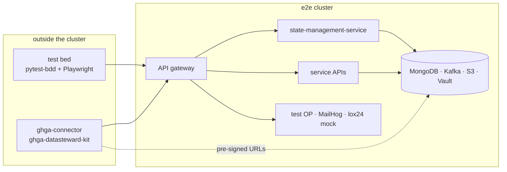

# Test Bed Runs Against a Cluster (Cuckoo Wasp)

**Epic Type:** Implementation Epic

Epic planning and implementation follow the [Epic Planning and Marathon SOP](https://ghga.pages.hzdr.de/internal.ghga.de/main/sops/development/epic_planning/).

**Attention: Please do not put any confidential content here.**

## Scope

### Outline

The [test bed](../../testbed/) can run against any deployment from outside it, reaching the application only through the service APIs the gateway exposes.
The archived `archive-test-bed` repository was designed to run against "testing" cluster deployments, and can be shipped as a standalone image.
It was originally designed to accept a configuration file and an environment file (`.devcontainer/tb.remote.yaml` and `tb.remote.env`) to run from a remote Docker Compose setup.

The move into the monorepo updated the configuration with a single `kind-only` lane.
[`tb.kind.yaml`](../../testbed/tb.kind.yaml) is the only configuration, and `just testbed` wraps pytest in a prelude that needs `kubectl` against the cluster: a readiness gate, a secret harvest, two port-forwards, and a `sudo` edit of `/etc/hosts`.
This epic restores the end-to-end testing in cluster using test-bed from outside using similar approach to the archived implementation.

Since [ADR-0030](../adrs/adr-0030-state-management-service-testbed-only.md) every MongoDB, Kafka, S3 and Vault access goes through the `state-management-service` (SMS) over HTTP, and no host or path is hardcoded anywhere in `testbed/fixtures/` or `testbed/steps/`.
The one path that still needed S3 credentials, `upload_config_as_file` in `testbed/steps/utils.py`, has no caller left.

Two things are missing to achive the remote testing against cluster in monorepo:

- A configuration for the cluster,
- A way to run the suite without the `kind` prelude.

The only traffic that bypasses the gateway is the dotted line.
Services provide the connector with pre-signed S3 URLs and the runner should resolve and connect to them.

#### Execution workflow in black box

Add `tb.<env>.yaml` beside `tb.kind.yaml` (`external_base_url`, `data_portal_url`, `sms_url`, `mail_url`, `db names`, `auth_basic` if the gateway has it), export it as `TB_CONFIG_YAML` with the `TB_*` secrets, then c`d testbed && ../.venv-testbed/bin/pytest -v` — bypassing `just testbed`, which is kind-specific.

### Included/Required

- A cluster configuration, `testbed/tb.<env>.yaml`, holding URLs, database names and event-type names only.
  Every secret needed must arrive as a `TB_*` environment variable, never in the tracked file.
  The archived `tb.remote.yaml` is the template for which keys a cluster run needs.
- A `just testbed-remote <config>` recipe that exports `TB_CONFIG_YAML` and runs the suite, and that must not call `kubectl`, port-forward anything, or touch `/etc/hosts`.
- An amendment to [ADR-0030](../adrs/adr-0030-state-management-service-testbed-only.md) naming the e2e cluster as an environment where SMS may run, under a non-empty `config.db_prefix` and a `config.db_permissions` list scoped to the databases the suite touches.
  The decision as a whole stands, so this goes in as an amendment carrying an `amended` date.
- The e2e cluster must expose, through the gateway, the SMS API and the three test doubles the suite asserts against: the test OIDC provider, the mail server, and the lox24 SMS mock.
  The original "testing" deployment served them under a `/test/` prefix, which the configuration can follow or replace.
- Single operation mode: the black box is the only functioning mode, and it is being derived from the existing internal APIs.
  Basic authentication will be used in every case when auth basic is set.
  Delete the unnecessary duplicate of the flag in `testbed/fixtures/auth.py`, authentication using `TokenGenerator.key`, the abandoned `upload_config_as_file`, as well as the unused keys for S3 in `object_storages`.
- Documentation: [`testbed/README.md`](../../testbed/README.md) must describe the cluster lane and what a target deployment has to provide, and its "Modes of Operation" section must go with the flag.The root README's [recipe reference](../../README.md#recipe-reference) gains the new recipe.

### Optional

- Run the cluster lane from a container image rather than `.venv-testbed`, if a runner outside a developer machine turns out to be needed.

### Not included

- A standalone test-bed image and a lane that publishes it.
  The suite is not a uv workspace member, so it would need its own Dockerfile and release path; this epic proves the lane from a developer machine first.
- Automating the run in CI.
  The recipe runs on demand.
- New scenarios, and changes to any service, chart or the data portal.
- The `kind` lane, which keeps working unchanged apart from losing the flag.

## API Definitions

### RESTful/Synchronous

This epic adds no endpoints.
It makes the suite's existing dependency on the SMS API explicit, because a target deployment has to route it:

- `GET|PUT|DELETE /documents/{db}.{collection}`: read, seed and empty service databases
- `POST /events/`, `DELETE /events/`: publish a synthetic event, clear topics
- `GET|DELETE /objects/{storage_alias}/{bucket}[/{object_id}]`: inspect and empty buckets
- `GET|DELETE /secrets/{vault_path}`: inspect and empty file-encryption secrets

The suite also depends on two endpoints that are not part of the application: `POST {op_url}/login` on the test OIDC provider, which mints every user token, and MailHog's `/api/v1/messages` and `/api/v2/search`.

### Payload Schemas for Events

No event schema changes.
The suite publishes one synthetic event in the dead-letter-queue scenario, whose type name the configuration already carries as `dataset_upserted_type`.

## Additional Implementation Details

- **Security.**
  SMS can destroy all state of any database it is permitted to reach, which is why ADR-0030 keeps it out of the demo and production.
  The amendment must therefore pin three guardrails: a non-empty `db_prefix`, `db_permissions` listing only the suite's databases, and a Vault-issued token instead of a shared value between callers.
- **Reachability first.**
  The runner needs the gateway host, the test doubles behind it, and the S3 endpoint the pre-signed URLs name.
  Check all three before attributing a failure to the suite.
- **Shared state.**
  The suite starts from an empty state and its feature files are ordered by numeric prefix, so two concurrent runs against one cluster will fail each other.
  Update the documentation; running them one at a time is assumed.
- **The `auth_basic` path is unproven here.**
  It is the one black-box branch the `kind` lane never exercises ([`testbed/fixtures/http_client.py`](../../testbed/fixtures/http_client.py)), so verify it against the cluster in the first run.

## Human Resource/Time Estimation

Number of sprints required: 1

Number of developers required: 1
